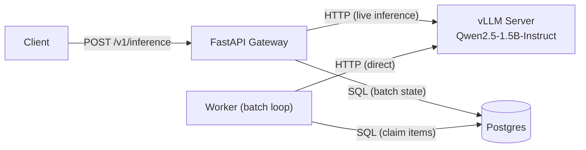

# AI Inference Platform

A self-hosted inference platform that sits between applications and a model. Live requests flow through a FastAPI gateway; batch jobs run through a background worker; both talk to vLLM serving an open-weight model. Postgres holds job state. Prometheus + Grafana + structured logs make it observable.

## Why

Most "AI platforms" are either a thin wrapper around a hosted API or an enterprise product weighed down by every feature its largest customer ever asked for. This project is neither. It's a small, deliberately-scoped system that does inference well — synchronous for live calls, asynchronous for batch — with the operational surface (metrics, logs, health checks, benchmarks) you'd actually want in front of a model in production.

## What it does

**Live inference.** Clients hit a single endpoint. Requests are validated, forwarded to vLLM, and the response comes back synchronously. Latency, throughput, and errors are visible through Prometheus metrics and structured JSON logs, correlated by request ID.

**Batch jobs.** Clients submit a job with N items. A background worker claims items from Postgres and processes them against vLLM, persisting per-item results. Job status and per-item outputs are queryable through the API. Failure is isolated per item — one bad input doesn't fail the job.

## Architecture



The worker calls vLLM directly — never through the gateway. Live request data lives in logs and metrics; only batch state lives in Postgres.

## Quickstart

A full end-to-end walkthrough — bring up the stack, run a live request, push a batch job through to completion, and see it in metrics. Commands use plain `docker compose` and `curl`; the `Makefile` wraps the same commands (`make up`, `make down`, `make bench-smoke`) if you prefer.

**Prerequisites**

- Docker and Docker Compose
- An NVIDIA GPU with the [container toolkit](https://docs.nvidia.com/datacenter/cloud-native/container-toolkit/latest/install-guide.html) installed — vLLM needs it. The reference setup runs on a 4GB GTX 1650 Ti; see [benchmarks/README.md](benchmarks/README.md) for hardware notes and baseline numbers.
- No `.env` required — the Compose defaults work as-is. Copy [.env.example](.env.example) to `.env` only if you want to customize anything.

> On Windows, run the `curl` commands below in Git Bash or use `curl.exe` — PowerShell aliases `curl` to `Invoke-WebRequest`, which takes different arguments.

**1. Start the stack**

```bash
docker compose up -d
```

First boot downloads ~3GB of model weights into a named volume, so vLLM can take a few minutes to report healthy. Weights persist across `docker compose down`, so later starts are fast. Watch progress with `docker compose logs -f vllm`.

**2. Check liveness and readiness**

```bash
curl http://localhost:8000/healthz
curl http://localhost:8000/readyz
```

`/healthz` returns `{"status":"ok"}` as soon as the gateway is up. `/readyz` returns `200` with `{"status":"ready","checks":{"vllm":true,"database":true}}` once vLLM and Postgres are both reachable — and `503` listing the failing dependency until then. Wait for `/readyz` to be ready before the next steps.

**3. Run a live inference request**

```bash
curl -X POST http://localhost:8000/v1/inference \
  -H "Content-Type: application/json" \
  -d '{"prompt": "Explain what a vector database is in one sentence.", "max_tokens": 64, "temperature": 0.7}'
```

```json
{
  "request_id": "3f9c0b1e-...",
  "model": "Qwen/Qwen2.5-1.5B-Instruct",
  "output": "A vector database is a system that stores data as numerical vectors ...",
  "usage": {"prompt_tokens": 18, "completion_tokens": 42},
  "latency_ms": 5123
}
```

The `request_id` is echoed on the `X-Request-ID` response header and appears in the gateway's structured logs for that request.

**4. Submit a batch job**

```bash
curl -X POST http://localhost:8000/v1/batch/jobs \
  -H "Content-Type: application/json" \
  -d '{
    "name": "demo-batch",
    "items": [
      {"input_payload": {"prompt": "Summarize the plot of Hamlet in one line."}},
      {"input_payload": {"prompt": "Name three primary colors."}}
    ]
  }'
```

The response is the created job with `"status": "queued"` and an `id` — copy it for the next step. The model is resolved from the active config; pass `"model": "<name>"` to pin a specific one.

**5. Watch it complete and inspect the results**

```bash
curl http://localhost:8000/v1/batch/jobs/<job_id>
curl http://localhost:8000/v1/batch/jobs/<job_id>/items
```

The job moves `queued` → `running` → `completed` as the worker drains it, with `completed_items` / `failed_items` updating as it goes. Each item carries its result: a completed item has an `output_payload` (output, model, token usage); a failed one has an `error_message` and a null `output_payload`. One bad input fails only its own item, not the job.

**6. (Optional) List the model configs**

```bash
curl http://localhost:8000/v1/models
```

Returns the active model configs — the source of truth for which model the platform serves and with what serving parameters.

**7. See it in Grafana**

Open [http://localhost:3000](http://localhost:3000) (anonymous access is enabled) and look in the **AI Inference** dashboard folder — gateway, worker, and system-overview dashboards. Request rate, error ratio, latency quantiles, batch throughput, and queue lag populate as you send traffic.

**8. Run a benchmark**

```bash
make bench-smoke
```

Runs the k6 smoke scenario against the gateway and writes a JSON result plus a markdown summary into `benchmarks/results/`. `make bench-load` and `make bench-stress` run the heavier scenarios — see [benchmarks/README.md](benchmarks/README.md).

**9. Tear down**

```bash
docker compose down
```

Containers stop; the model-weights and Postgres volumes persist, so the next `docker compose up -d` starts quickly. Add `-v` to remove the volumes too.

Opening a pull request runs the CI pipeline — `ruff` + `black`, `pytest`, and a `docker compose build` smoke check — on every PR.

## Stack

| Layer | Choice |
|---|---|
| Gateway | FastAPI + Uvicorn |
| Worker | Plain Python loop |
| Model serving | vLLM, serving Qwen2.5-1.5B-Instruct |
| Database | PostgreSQL 16 + SQLModel + Alembic |
| HTTP client | httpx |
| Validation | Pydantic v2 |
| Config | Pydantic Settings (env-driven) |
| Metrics | Prometheus + Grafana |
| Logs | Structured JSON to stdout |
| Tracing | Correlation IDs |
| Worker queue | Postgres `SELECT FOR UPDATE SKIP LOCKED` |
| Benchmarks | k6 |
| Local dev | Docker Compose |
| CI | GitHub Actions |
| Lint/format | ruff + black via pre-commit |
| Package manager | uv |

## API

| Method | Path | Notes |
|---|---|---|
| `POST` | `/v1/inference` | Single synchronous inference |
| `GET`  | `/healthz` | Liveness |
| `GET`  | `/readyz` | Readiness — vLLM reachable + DB connected |
| `GET`  | `/metrics` | Prometheus scrape |
| `POST` | `/v1/batch/jobs` | Submit a batch job |
| `GET`  | `/v1/batch/jobs` | List jobs |
| `GET`  | `/v1/batch/jobs/{id}` | Job detail with progress |
| `GET`  | `/v1/batch/jobs/{id}/items` | Paginated item list |
| `GET`  | `/v1/models` | List active model configs |
| `GET`  | `/v1/models/{name}` | Specific config |

The inference request takes `prompt`, `max_tokens`, and `temperature`. The platform serves the model defined by the active config — there is no per-request model override and no caller-supplied metadata field, by design.

## Project layout

```
ai-inference-platform/
├── docker/                # Dockerfiles for gateway and worker
├── alembic/               # Migrations
├── src/aiinfra/           # Single package, two process entrypoints
│   ├── gateway/           #   FastAPI app
│   ├── worker/            #   Background loop
│   ├── db/                #   Engine, session, models
│   ├── schemas/           #   Pydantic request/response shapes
│   ├── vllm/              #   httpx client
│   └── observability/     #   Correlation IDs + Prometheus metrics
├── tests/                 # pytest — unit and integration
├── benchmarks/            # k6 scripts and results
├── observability/         # Prometheus config + Grafana dashboards
└── docs/                  # Architecture doc and diagrams
```

Gateway and worker share a single package with two process entrypoints. They run as separate containers but share DB access, config, the vLLM client, schemas, and observability primitives.

## Design choices

- **Single-model serving via vLLM, not multi-provider routing.** The focus is the inference layer, not provider abstraction.
- **Stateless live requests.** Conversation memory and orchestration belong to the calling application.
- **Postgres `SELECT FOR UPDATE SKIP LOCKED` for the worker queue.** Adding Redis would be infrastructure for its own sake at this scale.
- **Correlation IDs in structured logs over OpenTelemetry.** Sufficient observability without the operational weight.
- **Docker Compose as the reference environment.** Kubernetes is deployment surface, not project scope.

## License

MIT — see [LICENSE](LICENSE).
