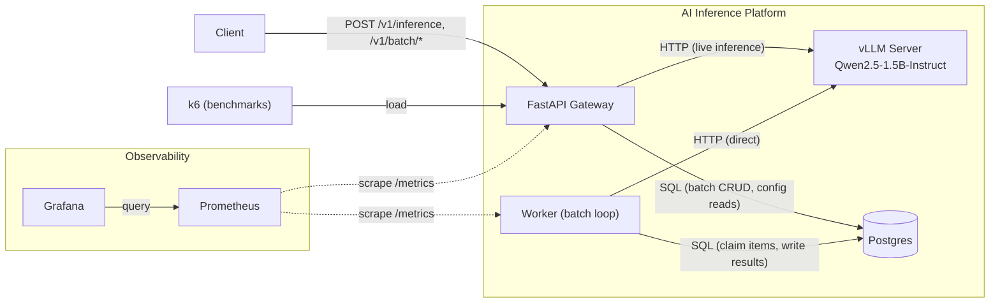
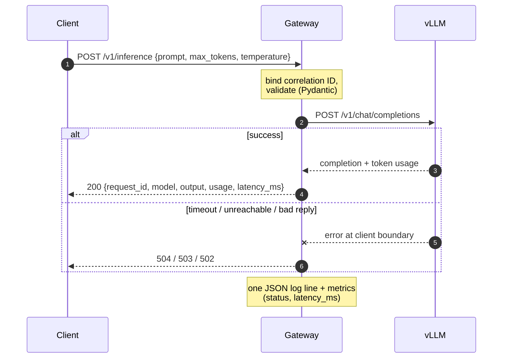
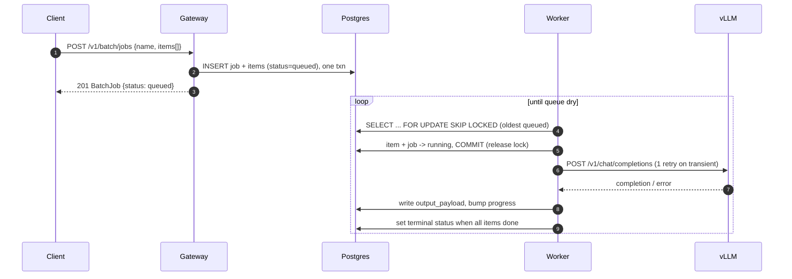
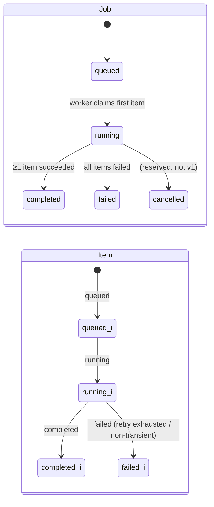
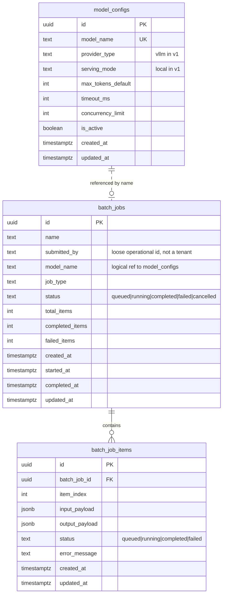
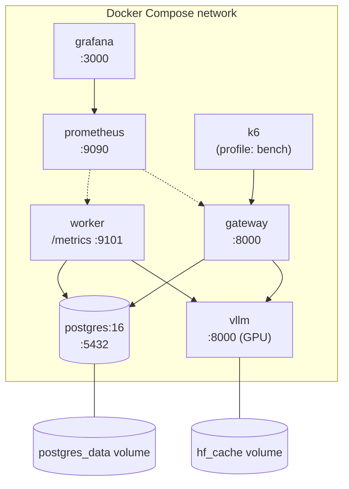

# Architecture

This document is the detailed system view of the AI Inference Platform. The
[README](../README.md) is the quickstart — overview, stack table, API table, and
how to run it. This doc covers the runtime behavior the README leaves out: how a
request actually flows, how a batch job moves through its lifecycle, what the data
model looks like, how telemetry is wired, and how the whole thing is deployed.

The system has two independent paths over one model server. **Live requests** go
through a synchronous FastAPI gateway and come straight back. **Batch jobs** are
persisted to Postgres and drained asynchronously by a background worker. Gateway
and worker are one Python package (`aiinfra`) with two process entrypoints; they
share the DB layer, config, the vLLM client, schemas, and observability
primitives, but run as separate containers and never call each other.

---

## System context

Clients reach only the gateway. The gateway serves live inference itself (calling
vLLM) and records batch work to Postgres. The worker reads that work back out of
Postgres and processes it by calling vLLM **directly** — never through the gateway.
Prometheus scrapes a `/metrics` endpoint on both the gateway and the worker;
Grafana reads from Prometheus; k6 drives the gateway during benchmark runs.

---

## Components

Each component owns a narrow slice. The boundaries below are the contract — what
each one is responsible for, what it depends on, and what it deliberately does not
do.

**FastAPI Gateway.** Owns the HTTP layer: request validation (Pydantic v2),
response shaping, batch-job CRUD, and gateway-side logs and metrics. Calls vLLM
for live inference and Postgres for batch CRUD and config reads. Does **not**
process batch items, own model-serving logic, or schedule the worker.

**Worker.** Owns the batch execution loop: claim queued items, process them
against vLLM, persist results, and update progress and terminal status. Calls
Postgres and vLLM directly. Exposes no external API — only a local `/metrics`
endpoint for Prometheus. A single worker process in v1; the claim mechanism is
already safe for horizontal scaling later.

**vLLM Server.** Owns model inference and nothing else. Serves
Qwen2.5-1.5B-Instruct over an OpenAI-compatible HTTP API
(`/v1/chat/completions`). Knows nothing about jobs, items, or persistence.

**Postgres.** Owns `batch_jobs`, `batch_job_items`, and `model_configs`. Does
**not** store live request bodies or responses, benchmark results, or session
state — live data lives in logs and metrics, benchmark results live as artifact
files.

**Observability layer.** Prometheus scrapes both processes; Grafana dashboards
read from Prometheus; structured JSON logs go to stdout and are captured via
container logs; correlation IDs thread request and item identity through the logs.
No OpenTelemetry.

---

## Live inference path

A single `POST /v1/inference` is fully synchronous. The gateway binds a
correlation ID (honoring an inbound `X-Request-ID` or generating one), validates
the body, calls vLLM through a shared async httpx client, shapes the response, and
emits exactly one structured log line plus metrics on the way out — on success and
on every mapped failure alike.

The vLLM client maps transport and protocol failures to typed errors at the
boundary, and the route maps those to HTTP status codes: a timeout becomes **504**,
an unreachable server **503**, and a malformed or non-2xx reply **502**.

---

## Batch job path

Submission and execution are decoupled. `POST /v1/batch/jobs` resolves the model
(from the active config, or validates a supplied one), then persists the job and
all its items as `queued` in a single transaction and returns `201` immediately —
the gateway only records the work. The worker drains it on its own clock.

The worker loop claims one item at a time with `SELECT ... FOR UPDATE SKIP LOCKED`
over queued items — the Postgres-as-queue mechanism, no Redis. It flips the item
(and its job, once) to `running`, **commits to release the row lock before** the
slow vLLM call, then processes the item: one retry on a transient error
(timeout/connection), immediate fail otherwise. On success it writes the
`output_payload`; either way it bumps the job's `completed_items`/`failed_items`,
and when every item is accounted for it sets the terminal status — `failed` only
if nothing succeeded, otherwise `completed`.

### Job and item lifecycle

A job's status is derived from its items. An item is `queued` until claimed,
`running` while being processed, then `completed` or `failed`. A job follows the
same path and lands on `completed` or `failed` depending on whether any item
succeeded; `cancelled` is a defined terminal state for jobs but is not driven by
the worker in v1.

---

## Data model

Three tables. `batch_jobs` and `batch_job_items` are a strict parent/child FK
relationship. `model_configs` is referenced by `batch_jobs.model_name` logically —
by name, not a database foreign key — so a job records which model it ran against
without coupling job rows to config-row lifetimes. A composite index on
`batch_job_items (batch_job_id, status)` backs the worker's claim query.

What is **not** here is as deliberate as what is: no live request bodies or
responses (those are logs and metrics), no benchmark results (artifact files), no
session or conversation state (out of scope).

`model_configs` is the source of truth for model resolution — seeded with the
single active Qwen config by migration `0001`, not read from an env var at request
time.

---

## Observability

Three layers, one identity thread running through them.

**Structured logs.** Every process logs JSON to stdout via a custom
`JsonFormatter` — minimum `ts/level/logger/msg`, with per-request and per-item
fields merged in. The gateway emits one line per inference request
(`request_id`, `status`, `latency_ms`, token usage on success); the worker logs
per-item outcomes and the vLLM retry warning.

**Metrics.** Both processes expose Prometheus text on `/metrics` — the gateway via
a route, the worker via a small WSGI server on a daemon thread (port `9101`) so a
scrape can never block the claim/process cycle. The metric set is deliberately
small, with no redundant counters: the error count is the non-`ok` slice of a
labeled counter, and the items-processed count is a histogram's `_count`.

| Metric | Type | Labels | Meaning |
|---|---|---|---|
| `aiinfra_inference_requests_total` | counter | `status` | Live requests by outcome (errors = `status != "ok"`) |
| `aiinfra_inference_request_duration_seconds` | histogram | `status` | Gateway-measured request latency |
| `aiinfra_batch_jobs_total` | counter | `status` | Jobs reaching a terminal status |
| `aiinfra_batch_item_processing_duration_seconds` | histogram | `status` | Per-item processing time (`_count` = items processed) |
| `aiinfra_batch_queue_lag_seconds` | gauge | — | Age of the oldest queued item; 0 when empty |

**Correlation IDs.** A `contextvars` store plus a logging filter stamp
`request_id`/`job_id`/`item_id` onto every record automatically, so a request or
item is traceable across all the lines it produces — not just hand-instrumented
ones. The gateway binds the ID in a pure-ASGI middleware (chosen over
`BaseHTTPMiddleware` for contextvar visibility) and echoes it on the response
header; the worker binds `job_id`/`item_id` per item. IDs stay in logs and never
become Prometheus labels — that would blow up metric cardinality.

Grafana loads its datasource and three starter dashboards (gateway, worker, system
overview) from provisioning files on boot, so the dashboards are version-controlled
rather than clicked together by hand.

---

## Deployment topology

The reference environment is a Docker Compose stack — the same one `docker compose
up` brings up. Gateway and worker are built from `docker/`; the rest are stock
images. The `hf_cache` named volume persists the ~3GB Qwen download across
`compose down`, and a `postgres_data` volume persists job state. The k6 service is
gated behind a `bench` profile so it stays off `make up` and CI, only running on
`make bench-*`.

### Hardware constraints and what production would change

The documented baselines were measured on a 4GB GTX 1650 Ti — a Turing card with
**no tensor cores** — and the vLLM flags reflect that constraint rather than a
production tuning. On this hardware the platform sustains roughly **2 concurrent
requests / ~0.5 req/s**; the bottleneck is per-request decode latency (no tensor
cores, eager execution), not the batch-size cap. The current settings are:

- `--dtype float16`, `--enforce-eager` — eager execution skips CUDA-graph capture,
  which a 4GB card can't spare memory for; it costs latency.
- `--gpu-memory-utilization 0.78` — low because the Windows desktop already
  consumes ~780MB of the 4GB card, leaving little KV-cache headroom.
- `--max-model-len 2048`, `--max-num-seqs 8` — small context and batch window to
  fit the available VRAM.
- `--attention-config.backend TRITON_ATTN` — the default FlashInfer backend needs
  tensor cores this card lacks.

A production deployment would change the hardware first and the flags as a
consequence: a tensor-core GPU (Ampere or newer) with enough VRAM to **drop
`--enforce-eager`** (re-enabling CUDA graphs), raise `--gpu-memory-utilization`
toward 0.90+, increase `--max-model-len` and `--max-num-seqs` to use the larger
KV cache, and let vLLM pick its default attention backend. The
`model_configs.concurrency_limit` and the 30s client timeout would be retuned to
the measured capacity of that hardware. None of this changes the architecture —
only the serving parameters and the numbers in the benchmark baselines.

---

## Key design decisions

Terse pointers to the locked calls; each is settled, not open for relitigation.

- **vLLM, single-model, not multi-provider routing** — the focus is the inference
  layer, not a provider-abstraction shim. No per-request model override in v1.
- **Postgres `SELECT FOR UPDATE SKIP LOCKED` as the queue, not Redis** — adding a
  broker would be infrastructure for its own sake at this scale.
- **Correlation IDs in structured logs, not OpenTelemetry** — sufficient
  traceability without the operational weight.
- **Stateless live requests** — conversation memory and orchestration belong to
  the calling application, not this platform.
- **Benchmark results as artifact files, not a DB table** — Postgres holds batch
  state only; benchmark output lives in `benchmarks/results/`.
- **Docker Compose as the reference environment** — Kubernetes is deployment
  surface, not project scope.
</content>
</invoke>
